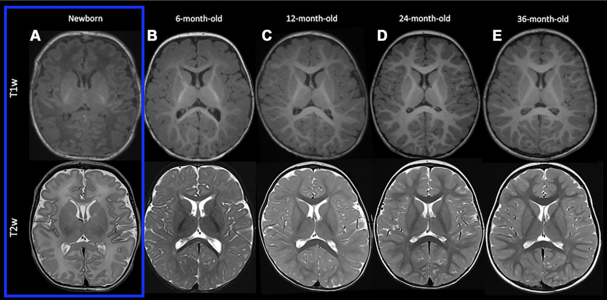
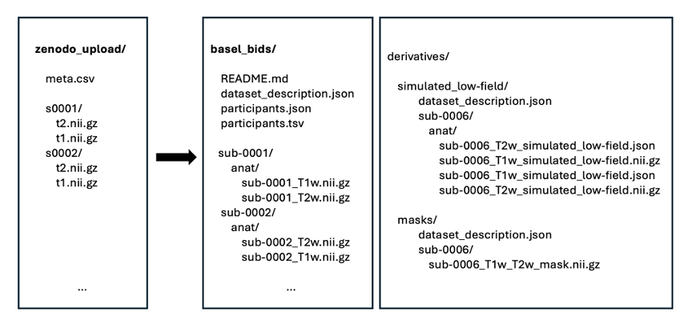
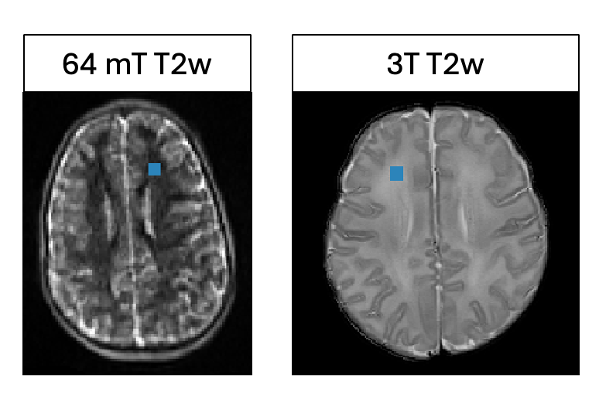
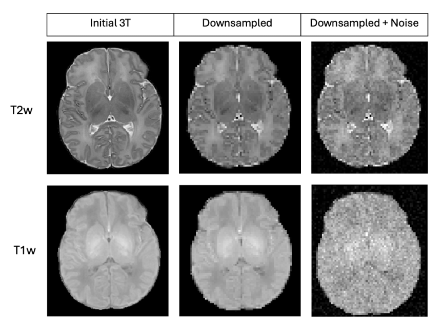
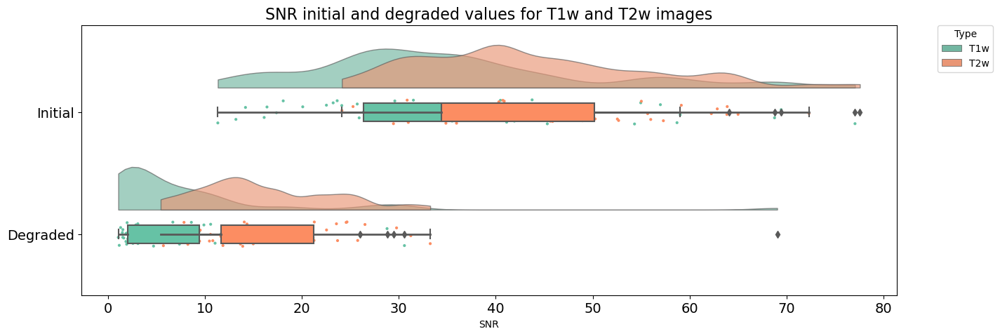

# About me

My name is Alexia Mahlig, and I come from a background in mechanical and clinical engineering. I am currently enrolled in the first year of a master’s degree in biomedical engineering at Polytechnique Montreal where my project focuses on applying deep learning techniques to enhance ultra-low-field brain MRI. 

# Background

The advent of portable ultra-low-field MRI devices presents promising opportunities for increased accessibility to MRI technology, particularly for the neonatal population, where obtaining high-quality MRI images is more challenging. However, these devices face limitations due to the physical constraints of their low magnetic field strength, which impacts the quality of the images they can produce. Deep learning offers potential solutions to these challenges, but require large datasets of paired images, which are currently very limited.

My project aims to generate simulated ultra-low-field neonatal brain MRI images from high-field MRI scans. By creating this paired dataset of high-field and ultra-low-field images, I hope to lay the groundwork for training a deep learning algorithm capable of reconstructing high-resolution images from ultra-low-field MRI data. 

## Main Objectives

- Convert the dataset to comply with the BIDS format.
- Degrade image quality of a high-field MRI dataset to simulate ultra-low-field MRI.

## Personal Objectives

- Familiarize myself with the best practices in neuroimaging research.
- Learn how to use essential tools of open-science coding, such as Git, GitHub, Python, Jupyter Notebook, etc.
- Acquire the skills needed to complete a small coding project.

# Tools

The following tools were used in this project:

- `Git` and `GitHub` for version control and documentation
- [FSL](https://fsl.fmrib.ox.ac.uk/fsl/fslwiki/) for mask creation and image viewing
- [BIDS validator](https://bids-standard.github.io/bids-validator/) to confirm the formatting of the dataset
- `Jupyter notebook` to describe the analysis and visualize the results 
- `Python` for the analysis, including several librairies such as: 
    - `Nilearn`
    - `Nibabel`
    - `Numpy`
    - `Pandas`
    - `Matplotlib`
    - `Seaborn`

# Data

The dataset for this project included T1w and T2w images acquired at 3T from 833 subjects, both healthy and non-healthy, aged between 0 and 36 months from the University Children's Hospital Basel, Switzerland. Given the project's focus on neonates, the dataset was filtered to include only images of healthy subjects under 1 month old, resulting in a subset of 61 subjects.

The dataset is open-source and can be downloaded [here](https://zenodo.org/records/6556135) from the Zenodo database.

Additionally, this project used one T1w and one T2w ultra-low-field image of a healthy 5-year-old subject acquired with a [Hyperfine](https://hyperfine.io/) 64 mT scanner at the CHU Sainte-Justine Azrieli Research Center in Montreal, Canada. These two images are not publicly available but were used as the reference to calibrate the metrics for the degradation of the high-field images.

# Deliverables

The deliverables for this project are included in this github repository and contain:

- This `README` markdown file explaining the project
- A `Jupyter Notebook` of the analysis with visualization
- The following Python scripts :
    - `bids_conversion.py` to convert the dataset to BIDS
    - `calcul_snr.py` to compute the SNR of the images
    - `degradation.py` to process the image degradation

# Methods and Results

The following sections outline the steps taken to achieve the project objectives and present the corresponding results. The analysis workflow can also be visualized in the Jupyter Notebook `main.ipynb` after installing the packages listed in the `requirements.txt` file.

## BIDS

The Brain Imaging Data Structure ([BIDS](https://bids.neuroimaging.io/)) was created in an effort to standardize the way researchers organize and describe neuroimaging data. Using this data structure is considered a best practice in the field because it facilitates access to information within the dataset and enhances the reproducibility of research findings.

Therefore, the initial task of my project was to convert the dataset to comply with the BIDS format. To achieve this, the files and folders were reorganized, and the missing accompanying files were generated using the Python script `bids_conversion.py`. The figure below shows the initial and updated data structure of the dataset.

## Image degradation

### 1. Downsampling

The initial step in degrading the high-field MRI images involved downsampling them to a resolution typically found in ultra-low-field imaging. The resolution of the ultra-low-field and high-field images was determined using the `fslinfo` command in `FSL`. All images in the high-field dataset shared the same resolution and were downsampled using the `nilearn` library.

Initial resolution: 0.6 x 0.6 x 3 mm  
Degraded resolution: 1.6 x 1.6 x 5 mm

### 2. Noise Addition

Due to the complexity of MRI physics, low field MRIs are not merely low-resolution reproduction of high-field images. A phenomenon known as "domain shift" introduces variations that affect both the appearance and quality of the images. One significant difference between images acquired at different magnetic field strengths is the signal-to-noise ratio (SNR), which is typically higher in high-field images.

The next step in degrading my images involved reducing this SNR. Initially, I computed the SNR of both my dataset images and the ultra-low-field images. Since the images in my dataset had their backgrounds removed, SNR was estimated within a uniform region. A manually defined region of interest of 9 pixels square (marked in blue), was delineated using `FSL` for all dataset images and the ultra-low-field images, serving as a uniform region for SNR estimation.

  

The appropriate amount of random Gaussian noise was then computed and added to each image using the `degradation.py` script. The figure below displays the T1w and T2w images of a subject from the dataset at each stage of degradation.

The following figure illustrates the SNR changes across the entire dataset. It is evident that the SNR of the degraded images is significantly lower compared to the original images. With SNR values computed from the ultra-low-field images being 4 for T1w and 19 for T2w, the degradation adjusted these SNR values to closely match those typically found at 64mT.

# Conclusion

This project focused primarily on adjusting resolution and SNR for image degradation. However, the simulation could be improved by addressing other MRI characteristics that also vary with magnetic field strength. Additionally, the SNR computation method that was used relied on broad estimations of noise distributions within the image, which may lead to inaccuracies in the resulting SNR values. Future work should address these limitations to achieve a more realistic simulation of ultra-low-field MRI.

Overall, regarding the objectives, tools, and deliverables, I consider this project a success. I effectively produced a dataset of simulated ultra-low-field images derived from high-field images. More importantly, I gained valuable insights into best practices in neuroimaging research, learned how to use essential tools like Git and GitHub, and significantly enhanced my coding skills to successfully complete this project.

# Acknowledgment

I am deeply grateful to the Brainhack organization for orchestrating this exceptional course and providing well-crafted learning modules. Thanks to this course, I have made significant progress in a short amount of time which will undoubtedly benefit the remainder of my master's degree. I also want to thank Professor Eva Alonso Ortiz and the TAs Daniel Ridani and Jan Valosek for their patient responses to my numerous questions about coding and neuroimaging. Lastly, I extend my thanks to my colleagues at the Polytechnique hub for their continuous support throughout this journey.

# References

T. Akinci D’Antonoli et al., « Development and Evaluation of Deep Learning Models for Automated Estimation of Myelin Maturation Using Pediatric Brain MRI Scans », Radiol Artif Intell, vol. 5, no 5, p. e220292, juill. 2023, doi: 10.1148/ryai.220292.

J. E. Iglesias et al., « Joint super-resolution and synthesis of 1 mm isotropic MP-RAGE volumes from clinical MRI exams with scans of different orientation, resolution and contrast », NeuroImage, vol. 237, p. 118206, août 2021, doi: 10.1016/j.neuroimage.2021.118206.

J. Rajan, D. Poot, J. Juntu, et J. Sijbers, « Noise measurement from magnitude MRI using local estimates of variance and skewness », Phys. Med. Biol., vol. 55, no 16, p. N441 N449, août 2010, doi: 10.1088/0031-9155/55/16/N02.

E. Plenge et al., « Super-resolution methods in MRI: Can they improve the trade-off between resolution, signal-to-noise ratio, and acquisition time? », Magnetic Resonance in Medicine, vol. 68, no 6, p. 1983‑1993, 2012, doi: 10.1002/mrm.24187.

